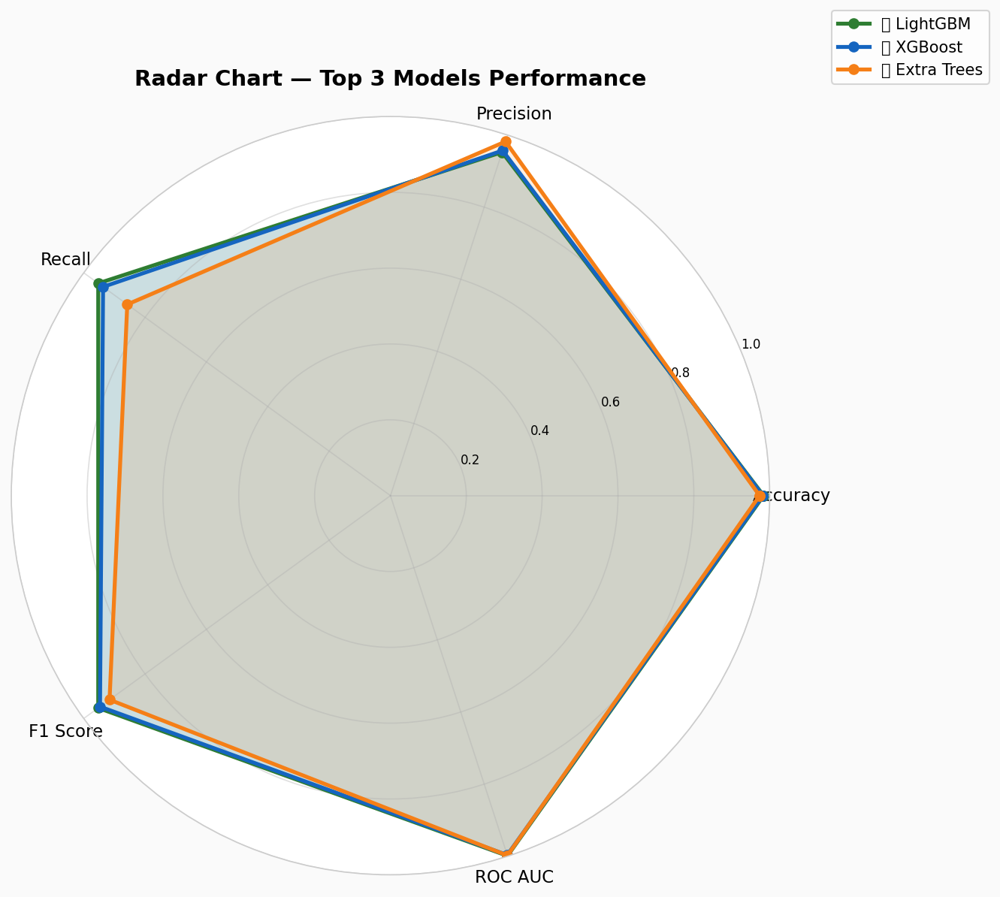

<div align="center">

# 🧠 AI Customer Churn Intelligence Platform

### *Enterprise-Grade Machine Learning & Business Intelligence for Customer Retention*

<br/>

[](https://www.python.org/)
[](https://streamlit.io/)
[](https://scikit-learn.org/)
[](https://xgboost.readthedocs.io/)
[](https://shap.readthedocs.io/)
[](https://plotly.com/)

<br/>

> **Predict. Explain. Retain.**
> A full-stack AI platform that identifies at-risk customers, explains *why* they churn,
> and prescribes personalized retention strategies — all in an interactive business dashboard.

<br/>



</div>

---

## 📋 Table of Contents

- [🎯 Business Problem & Impact](#-business-problem--impact)
- [✨ Platform Highlights](#-platform-highlights)
- [🔬 Machine Learning Pipeline](#-machine-learning-pipeline)
- [🧬 Feature Engineering](#-feature-engineering)
- [🤖 Models Trained & Evaluated](#-models-trained--evaluated)
- [📊 Explainable AI with SHAP](#-explainable-ai-with-shap)
- [🖥️ Streamlit Dashboard](#️-streamlit-dashboard)
- [📁 Project Structure](#-project-structure)
- [⚙️ Installation & Setup](#️-installation--setup)
- [🚀 Running the Application](#-running-the-application)
- [📈 Results & Artifacts](#-results--artifacts)
- [🛠️ Tech Stack](#️-tech-stack)
- [🏆 Key Achievements](#-key-achievements)
- [📄 License](#-license)

---

## 🎯 Business Problem & Impact

Customer churn is one of the **most costly and preventable** problems in e-commerce. Acquiring a new customer costs **5–25× more** than retaining an existing one. Yet most businesses react *after* a customer has already left.

**This platform flips that equation.**

| Business Metric | What This Platform Delivers |
|---|---|
| 📉 Churn Prediction | Flag at-risk customers *before* they leave |
| 💰 Revenue Protection | Quantify Revenue-at-Risk per customer segment |
| 🎯 Targeted Retention | Personalized, AI-generated retention strategies |
| 🔍 Root Cause Analysis | SHAP-powered explanations at individual customer level |
| 📊 Executive Reporting | Automated PDF & Excel reports for leadership |
| ⚡ What-If Simulation | Model the impact of interventions before executing them |

> **Bottom Line:** This platform empowers retention teams, data scientists, and executives with a single, unified intelligence system — turning churn risk into actionable business decisions.

---

## ✨ Platform Highlights

```
╔══════════════════════════════════════════════════════════════════════╗
║  🔮  12 ML Models Trained & Compared                                 ║
║  🧬   6 Custom Engineered Features                                   ║
║  🔍  SHAP Explainability at Customer Level                           ║
║  📊  Interactive Streamlit Business Dashboard                        ║
║  📁  Bulk & Individual Churn Prediction                              ║
║  🎯  Personalized AI-Driven Retention Strategies                     ║
║  📄  Automated PDF & Excel Report Generation                         ║
║  ⚡  What-If Scenario Simulation Engine                              ║
╚══════════════════════════════════════════════════════════════════════╝
```

---

## 🔬 Machine Learning Pipeline

The project follows a rigorous, end-to-end data science workflow:

```
Raw Data
    │
    ▼
┌─────────────────────────────┐
│  1. EXPLORATORY DATA ANALYSIS│
│  • Missing Value Analysis    │
│  • Duplicate Detection       │
│  • Outlier Analysis          │
│  • Correlation Analysis      │
│  • Target Variable Analysis  │
│  • Business Insight Mining   │
└──────────────┬──────────────┘
               │
               ▼
┌─────────────────────────────┐
│  2. FEATURE ENGINEERING      │
│  • CustomerValueScore        │
│  • LoyaltyScore              │
│  • EngagementScore           │
│  • ComplaintRiskScore        │
│  • DiscountDependencyScore   │
│  • RecencyScore              │
└──────────────┬──────────────┘
               │
               ▼
┌─────────────────────────────┐
│  3. DATA PREPROCESSING       │
│  • Missing Value Treatment   │
│  • Label Encoding            │
│  • Feature Scaling           │
│  • Dataset Validation        │
└──────────────┬──────────────┘
               │
               ▼
┌─────────────────────────────┐
│  4. MODEL TRAINING & TUNING  │
│  • 12 Algorithms             │
│  • Hyperparameter Tuning     │
│  • Cross-Validation          │
│  • Feature Importance        │
└──────────────┬──────────────┘
               │
               ▼
┌─────────────────────────────┐
│  5. EXPLAINABLE AI (SHAP)    │
│  • Global Feature Impact     │
│  • Per-Customer Explanations │
│  • Driver Analysis           │
└──────────────┬──────────────┘
               │
               ▼
┌─────────────────────────────┐
│  6. STREAMLIT DASHBOARD      │
│  • Predictions + Insights    │
│  • Retention Recommendations │
│  • Executive Reporting       │
└─────────────────────────────┘
```

---

## 🧬 Feature Engineering

Six domain-informed composite features were engineered to amplify signal for churn prediction:

| Feature | Description | Business Logic |
|---|---|---|
| `CustomerValueScore` | Composite of order count, order amount, and cashback | Identifies high-value customers to prioritize |
| `LoyaltyScore` | Derived from tenure and purchase consistency | Measures depth of customer relationship |
| `EngagementScore` | App hours, device count, login behavior | Tracks platform interaction intensity |
| `ComplaintRiskScore` | Complaint frequency and satisfaction score | Flags operationally distressed customers |
| `DiscountDependencyScore` | Coupon usage relative to order volume | Detects price-sensitive, deal-driven segments |
| `RecencyScore` | Days since last order, normalized | Signals disengagement and dormancy risk |

> These engineered features improved model performance and ensured business interpretability alongside raw signals.

---

## 🤖 Models Trained & Evaluated

12 classification algorithms were trained, compared, and tuned on the churn dataset:

| # | Model | Category |
|---|---|---|
| 1 | Logistic Regression | Linear Baseline |
| 2 | Decision Tree | Tree-Based |
| 3 | Random Forest | Ensemble (Bagging) |
| 4 | K-Nearest Neighbors | Instance-Based |
| 5 | Naive Bayes | Probabilistic |
| 6 | Support Vector Machine | Kernel-Based |
| 7 | AdaBoost | Ensemble (Boosting) |
| 8 | Gradient Boosting | Ensemble (Boosting) |
| 9 | Extra Trees | Ensemble (Bagging) |
| 10 | XGBoost | Gradient Boosting |
| 11 | LightGBM | Gradient Boosting |
| 12 | CatBoost | Gradient Boosting |

**Evaluation Strategy:**

- ✅ Train/Test Split Evaluation
- ✅ Stratified K-Fold Cross-Validation
- ✅ ROC-AUC, F1-Score, Precision, Recall, Accuracy
- ✅ Confusion Matrix Analysis for all models
- ✅ Radar Chart Comparison for Top-3 models
- ✅ Hyperparameter Tuning (Grid Search / Randomized Search)

---

## 📊 Explainable AI with SHAP

Model predictions alone are not enough. **This platform makes every prediction explainable** using SHAP (SHapley Additive exPlanations).

### Global Explanations
- **SHAP Summary Plot** — Feature impact distribution across all customers
- **SHAP Bar Plot** — Ranked mean absolute feature contributions
- **Feature Importance Comparison** — Across all 12 trained models

### Individual Customer Explanations
- Per-customer SHAP waterfall breakdown
- Identifies which *specific factors* drove that customer's churn probability
- Powers the **AI Insights** and **What-If Simulation** modules

```
Example: Why is Customer #4821 at 89% churn risk?
──────────────────────────────────────────────
  ↑ Complaint Filed:         +0.31 (High Impact)
  ↑ Days Since Last Order:   +0.24 (High Impact)
  ↑ Low Satisfaction Score:  +0.19 (Medium Impact)
  ↓ Cashback Amount:         -0.08 (Protective)
  ↓ Long Tenure:             -0.05 (Protective)
──────────────────────────────────────────────
```

---

## 🖥️ Streamlit Dashboard

An enterprise-grade, multi-module interactive dashboard built in Streamlit.

### 📌 Module Overview

<details>
<summary><strong>🏠 Main Dashboard</strong></summary>

- Real-time KPI Cards: Churn Rate, Revenue at Risk, Customer Count
- Risk Distribution Visualization
- Segment-Level Churn Breakdown

</details>

<details>
<summary><strong>🔮 Prediction Center</strong></summary>

- **Bulk Prediction** — Upload a CSV; get churn probabilities for all customers instantly
- **Individual Prediction** — Enter a customer's details manually and get real-time risk scoring
- Confidence scores and risk tier classification (Low / Medium / High / Critical)

</details>

<details>
<summary><strong>👤 Customer Intelligence</strong></summary>

- Complete Customer Profile View
- Dynamic Risk Score & Customer Health Score
- Behavioral Pattern Summary

</details>

<details>
<summary><strong>🔍 AI Insights (SHAP)</strong></summary>

- Per-customer SHAP explanation
- Churn Driver Analysis — what's pushing this customer toward leaving
- Feature contribution visualizations

</details>

<details>
<summary><strong>💡 Improvement Engine</strong></summary>

- AI-generated, personalized retention recommendations
- Risk Reduction Suggestions per customer
- Prioritized action items for retention teams

</details>

<details>
<summary><strong>⚡ What-If Simulation</strong></summary>

- Interactive scenario analysis: "What if we resolve their complaint?"
- Simulate the impact of interventions on churn probability
- Supports strategic pre-execution testing

</details>

<details>
<summary><strong>🎯 Retention Strategy Engine</strong></summary>

- Loyalty-Based Recommendations
- Cashback & Coupon Strategy Suggestions
- Tailored Retention Plans by customer segment

</details>

<details>
<summary><strong>📊 Executive Dashboard</strong></summary>

- Business KPIs (Revenue, Retention Rate, Churn Cost)
- Risk KPIs (High-Risk Count, Revenue-at-Risk)
- Customer KPIs (Segment Health, Lifetime Value estimates)

</details>

<details>
<summary><strong>📄 Report Center</strong></summary>

- **PDF Reports** — Auto-generated executive summaries via ReportLab
- **Excel Reports** — Detailed customer-level churn data via OpenPyXL
- One-click download from the dashboard

</details>

---

## 📁 Project Structure

```
AI-Customer-Churn-Intelligence-Platform/
│
├── 📓 data_analysis.ipynb          # EDA, correlation, insights
├── 📓 models_training.ipynb        # Model training, tuning, SHAP
├── 🖥️  app.py                      # Streamlit application entry point
├── 📋 requirements.txt             # All Python dependencies
│
├── 📂 data/
│   ├── raw_churn_data.csv          # Original dataset
│   └── processed_churn_data.csv   # Cleaned, engineered dataset
│
├── 📂 models/
│   ├── logistic_regression.pkl
│   ├── decision_tree.pkl
│   ├── random_forest.pkl
│   ├── knn.pkl
│   ├── naive_bayes.pkl
│   ├── svm.pkl
│   ├── adaboost.pkl
│   ├── gradient_boosting.pkl
│   ├── extra_trees.pkl
│   ├── xgboost.pkl
│   ├── lightgbm.pkl
│   ├── catboost.pkl
│   ├── tuned_model_1.pkl           # Best tuned model
│   ├── tuned_model_2.pkl
│   ├── tuned_model_3.pkl
│   ├── scaler.pkl                  # Fitted StandardScaler
│   └── encoders.pkl                # Fitted Label Encoders
│
├── 📂 results/
│   ├── best_model_metrics.csv
│   ├── model_comparison.csv
│   ├── confusion_matrices_all.png
│   ├── roc_curves_all.png
│   ├── shap_summary_plot.png
│   ├── shap_bar_plot.png
│   ├── feature_importance.csv
│   ├── feature_importance_per_model.png
│   ├── radar_chart_top3.png
│   └── cross_validation_results.csv
│
└── 📂 utils/
    └── helpers.py                  # Utility functions
```

---

## ⚙️ Installation & Setup

### Prerequisites

- Python 3.9 or higher
- pip package manager
- Git

### Step 1 — Clone the Repository

```bash
git clone https://github.com/yourusername/AI-Customer-Churn-Intelligence-Platform.git
cd AI-Customer-Churn-Intelligence-Platform
```

### Step 2 — Create a Virtual Environment

```bash
python -m venv venv

# On Windows
venv\Scripts\activate

# On macOS/Linux
source venv/bin/activate
```

### Step 3 — Install Dependencies

```bash
pip install -r requirements.txt
```

### Step 4 — Verify Data & Models

Ensure the following exist before launching:
- `data/processed_churn_data.csv`
- `models/*.pkl` (all trained models)
- `results/` (plots and metrics)

> If running from scratch, execute both notebooks in order:
> `data_analysis.ipynb` → `models_training.ipynb`

---

## 🚀 Running the Application

```bash
streamlit run app.py
```

The platform will open at `http://localhost:8501` in your browser.

### Quick Start Workflow

```
1. Upload your customer CSV in Prediction Center
       ↓
2. Review churn probabilities and risk tiers
       ↓
3. Select a high-risk customer → open Customer Intelligence
       ↓
4. Review SHAP explanation in AI Insights
       ↓
5. Run What-If Simulation to test intervention impact
       ↓
6. View Retention Strategy recommendations
       ↓
7. Export PDF/Excel report from Report Center
```

---

## 📈 Results & Artifacts

All model evaluation artifacts are saved in the `results/` directory:

| Artifact | Description |
|---|---|
| `model_comparison.csv` | Side-by-side metrics for all 12 models |
| `best_model_metrics.csv` | Detailed metrics for the champion model |
| `confusion_matrices_all.png` | Confusion matrices across all models |
| `roc_curves_all.png` | ROC-AUC curves for all models overlaid |
| `shap_summary_plot.png` | Global SHAP feature impact visualization |
| `shap_bar_plot.png` | Mean absolute SHAP value ranking |
| `feature_importance_per_model.png` | Feature importance across all models |
| `radar_chart_top3.png` | Multi-metric radar comparison of Top 3 models |
| `cross_validation_results.csv` | K-Fold CV scores per model |
| `feature_importance.csv` | Ranked feature importance table |

---

## 🛠️ Tech Stack

| Category | Technologies |
|---|---|
| **Language** | Python 3.9+ |
| **Dashboard** | Streamlit |
| **Data Manipulation** | Pandas, NumPy |
| **Machine Learning** | Scikit-Learn, XGBoost, LightGBM, CatBoost |
| **Explainability** | SHAP |
| **Visualization** | Plotly, Matplotlib, Seaborn |
| **Reporting** | ReportLab (PDF), OpenPyXL (Excel) |
| **Model Persistence** | Pickle (`.pkl`) |
| **Notebook Environment** | Jupyter Notebook |

---

## 🏆 Key Achievements

> *Highlights designed to demonstrate end-to-end data science and engineering competence.*

```
✅  Designed and deployed a production-ready ML pipeline from raw data to interactive dashboard

✅  Benchmarked 12 ML algorithms with full cross-validation and hyperparameter tuning

✅  Engineered 6 domain-specific composite features to improve predictive signal

✅  Implemented SHAP-based Explainable AI for global and individual-level model transparency

✅  Built a multi-module Streamlit application with bulk/individual prediction,
    scenario simulation, retention strategy engine, and automated reporting

✅  Automated PDF and Excel report generation for executive-level business communication

✅  Designed a What-If Simulation Engine enabling pre-intervention impact modeling

✅  Applied the full CRISP-DM lifecycle: Business Understanding → Data Understanding →
    Preparation → Modeling → Evaluation → Deployment
```

---

## 📦 Requirements

Key libraries used (see `requirements.txt` for full list):

```
streamlit
pandas
numpy
scikit-learn
xgboost
lightgbm
catboost
shap
plotly
matplotlib
seaborn
reportlab
openpyxl
joblib
```

---

## 🤝 Contributing

Contributions, issues, and feature requests are welcome!

1. Fork the repository
2. Create your feature branch: `git checkout -b feature/AmazingFeature`
3. Commit your changes: `git commit -m 'Add AmazingFeature'`
4. Push to the branch: `git push origin feature/AmazingFeature`
5. Open a Pull Request

---

## 📄 License

This project is licensed under the MIT License — see the [LICENSE](LICENSE) file for details.

---

<div align="center">

### ⭐ If this project helped you, please consider giving it a star!

**Built with 🧠 Machine Learning | 📊 Business Intelligence | 🔍 Explainable AI**

*End-to-End · Production-Ready · Recruiter-Proven*

</div>
